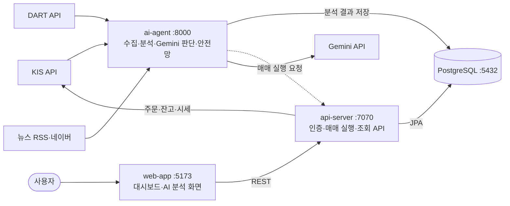

# FinanceManage Agent


> **데이터 분석을 통한 LLM 기반 주식 자동매매 시스템**
> 매 거래일 KOSPI 100 종목을 다축으로 분석해 11개 피처를 산출하고, 생성형 AI(Gemini)의 유연한 판단과 룰 기반 안전망의 안정성을 결합한 **이중 검증** 구조로 매수/매도를 결정해 KIS 모의투자 API로 자동 주문하는 시스템입니다.

---

## 왜 만들었나 (Motivation)

사람이 매일 반복하는 주식 분석·매매 루틴을, 감정을 배제한 **데이터 기반 자동 파이프라인**으로 옮기는 것이 목표입니다.

| | AS-IS — 사람의 수동 매매 | TO-BE — 데이터 기반 자동 파이프라인 |
|---|---|---|
| 시간 | 점검 항목이 많아 시간 소모 | 사람 개입 없이 동일 루틴 반복 |
| 범위 | 대상 종목 수가 곧 분석의 한계 | 대상을 좁히고 다축으로 동시 분석 |
| 일관성 | 동일 상황에도 판단이 흔들림 | 감정 없이 일관된 기준으로 실행 |
| 재현성 | 의사결정 근거를 재현하기 어려움 | 근거가 구조화된 매수/매도 후보 산출 |

> 단일 지표보다 **여러 신호를 종합**할 때 투자 판단이 효율적이라는 선행연구(Lopez-Lira & Tang, 2023 · JP Morgan LOXM)에 근거해 "종합 판단" 구조를 채택했습니다.

---

## 시스템 한눈에 보기 (At a Glance)

수집·분석·판단 / 매매 실행 / 표시 / 저장을 분리한 **4개 서비스**를 하나의 모노레포(Docker Compose)로 운영합니다.

| 디렉터리 | 역할 | 기술 스택 | 포트 |
|---------|------|----------|------|
| [`ai-agent/`](ai-agent/README.md) | 수집 · 3축 분석 · Gemini 판단 · 안전망 (파이프라인 코어) | Python, FastAPI, APScheduler, scikit-learn, Prophet, KR-FinBERT | 8000 |
| [`api-server/`](api-server/README.md) | 인증 · 매매 실행(KIS) · 거래내역 · 시장분석 조회 API | Spring Boot 4.1, JPA, Spring Security + JWT, Jasypt, Liquibase | 7070 |
| [`web-app/`](web-app/README.md) | 대시보드 · AI 분석 4탭 · 시각화 (PWA) | Vue 3, Vite, Tailwind CSS, Pinia | 5173 (dev) |
| [`database/`](database/README.md) | 분석 결과 · 예측 · 판단 · 거래 이력 영속 저장 | PostgreSQL 16 (17 tables + 2 views) | 5432 |



> ⏱ **매 거래일(평일) 08:50 KST** 분석 파이프라인이 자동 실행됩니다.
> web-app은 ai-agent를 직접 호출하지 않으며, ai-agent가 DB에 적재한 분석 결과를 **api-server를 통해** 조회합니다.

---

## 분석 프로세스 (Analysis Pipeline)

코스피 100 스캔부터 자동 주문까지 한 거래일의 전체 흐름입니다. 각 단계의 상세 설계·근거는 [`ai-agent/_docs/PIPELINE_DESIGN.md`](ai-agent/_docs/PIPELINE_DESIGN.md)에 있습니다.

```mermaid
flowchart TD
    A["① TOP 30 필터링<br/>코스피 100 · 4지표 · StandardScaler · 가중합산"] --> B

    subgraph B ["② 3축 분석 → 11개 피처"]
        direction LR
        B1["정량 7<br/>KIS 4 + DART 3"]
        B2["감성 1<br/>KR-FinBERT"]
        B3["시계열 3<br/>Prophet"]
    end

    B --> C["③ 생성형 AI 판단 (Gemini)<br/>11피처 + 보유여부 → 매수·매도 TOP3 (JSON)"]
    C --> D{"④ 룰 기반 안전망 필터<br/>수급·감성·추세 조건 재검증"}
    D -->|조건 충족| E["⑤ KIS 모의투자 자동 주문"]
    D -->|조건 미충족| F["주문 보류 (당일 스킵)"]
```



### 단계별 요약

| 단계 | 핵심 | 산출 |
|------|------|------|
| **① TOP 30 필터링** | 코스피 100 풀 고정 → 4개 지표(외국인·기관 순매수, 거래량 배율, 가격 변동성)를 StandardScaler로 매일 새로 정규화 → 가중합산(`|외국인|·0.3 + |기관|·0.3 + 거래량·0.3 + 변동성·0.1`) | 상위 30종목 (보유 종목 강제 포함) |
| **② 정량분석 (KIS 4 + DART 3)** | KIS 시세·수급(`morning_return`, `close_position`, 외국인·기관 순매수) + DART 분기 재무(PER·ROE·영업이익률, 분기 1회 갱신·매일 DB 조회) | 7개 피처 |
| **② 감성분석 (KR-FinBERT)** | 2트랙 분리 — 시장 전반(RSS 3개사 → 대시보드) / 종목별(네이버 금융 5건 → 시간 가중 평균). 제목+본문 200자, P(긍)−P(부) | `sentiment_score` 1개 |
| **② 시계열 예측 (Prophet)** | 종목별 120거래일 독립 학습 → D+1~D+5 예측 → 선형회귀 기울기로 추세 방향·강도 수치화 | 가격 추세·거래량 추세·불확실성 3개 |
| **③ AI 판단 (Gemini)** | "AI 트레이딩 어드바이저" 페르소나, 6가지 판단 기준(수급·모멘텀·펀더멘탈·뉴스·추세·불확실성), JSON 출력 강제 | 매수·매도 각 TOP3 + 근거 |
| **④ 안전망 필터** | 수급·감성·추세 조건을 룰로 재검증해 Gemini 자유도를 제어. 미충족 시 자동 보류 | 실행/보류 결정 |
| **⑤ 매매 실행** | `is_active=true`일 때 api-server를 통해 KIS 모의투자 주문 | 주문 체결 |

> **이중 검증 구조**: 1차로 생성형 AI(Gemini)가 수치로 표현하기 어려운 맥락까지 유연하게 종합 판단하고, 2차로 룰 기반 안전망이 수급·감성·추세 조건을 다시 검증해 과도한 판단을 차단합니다. 리뷰어 LLM을 두는 방식 대비 비용은 낮고 신뢰성은 높습니다.

---

## 문서 길찾기 (Documentation Map)

전체 문서의 진입점은 [`_docs/README.md`](_docs/README.md)입니다. 루트와 각 모듈의 `_docs/`는 **동일한 코어 구성**(`README` · `ARCHITECTURE` · `STATUS` · `USAGE`)을 따릅니다.

| 목적 | 문서 |
|------|------|
| 전체 문서 지도 | [`_docs/README.md`](_docs/README.md) |
| 시스템 아키텍처 · 데이터 흐름 | [`_docs/ARCHITECTURE.md`](_docs/ARCHITECTURE.md) |
| 전체 개발 현황 | [`_docs/STATUS.md`](_docs/STATUS.md) |
| 설치 · 실행 방법 | [`_docs/USAGE.md`](_docs/USAGE.md) |
| 프론트엔드 상세 | [`web-app/_docs/README.md`](web-app/_docs/README.md) |
| 백엔드 상세 | [`api-server/_docs/README.md`](api-server/_docs/README.md) |
| AI 파이프라인 상세 | [`ai-agent/_docs/README.md`](ai-agent/_docs/README.md) |
| DB 스키마 | [`database/README.md`](database/README.md) |
| AI(Claude Code) 작업 지침 | [`CLAUDE.md`](CLAUDE.md) |

---

## 빠른 시작 (Quick Start)

```bash
# 1. DB (PostgreSQL만 활성화되어 있음)
docker-compose up -d

# 2. api-server (:7070) — Liquibase가 스키마 자동 마이그레이션
cd api-server && ./gradlew bootRun

# 3. web-app (:5173)
cd web-app && npm install && npm run dev

# 4. ai-agent (:8000) — Prophet 때문에 venv 필수
cd ai-agent && ./run_dev.sh
```

설치 요구사항 · 환경변수 · 외부 API 키 발급 · 트러블슈팅 등 **자세한 실행 방법은 [`_docs/USAGE.md`](_docs/USAGE.md)** 를 참고하세요.

---

## 향후 확장 (Roadmap)

- 실시간 공시 데이터 확장
- 다변량 시계열 모델(LSTM) 도입
- 멀티유저(per-user KIS 계정) 구조

> 본 시스템은 대학원 최종 프로젝트로 시작했으며(단일 사용자 · KIS 모의투자 · 무료 Gemini 티어 전제), 현재 전체 기능 개발로 확장 중입니다. 진행 현황은 [`_docs/STATUS.md`](_docs/STATUS.md)를 참고하세요.
