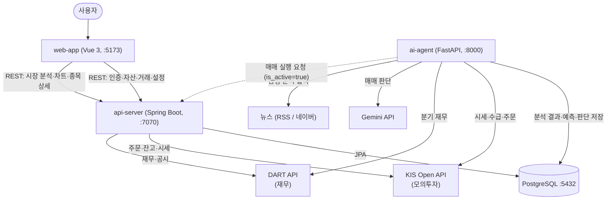
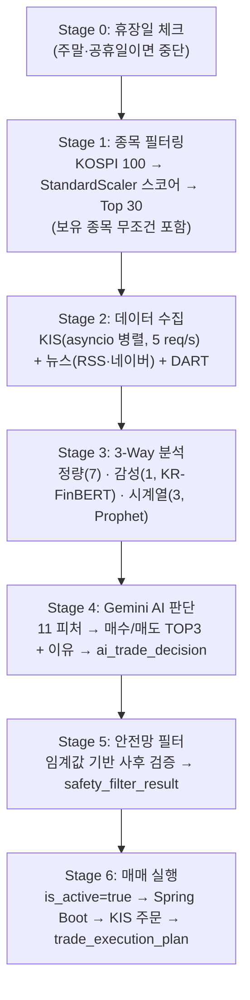

# 시스템 아키텍처 (System Architecture)

`FinanceManage_Agent` 모노레포 전체의 시스템 구조, 서비스 통신, 일일 파이프라인을 다룹니다. 모듈 내부 상세는 각 모듈의 `_docs/ARCHITECTURE.md`를 참고하세요.

---

## 1. 구성 요소 (Components)

| 서비스 | 기술 | 포트 (dev) | 역할 |
|--------|------|-----------|------|
| `web-app` | Vue 3, Vite, Tailwind CSS, PWA | 5173 | 사용자 화면 (대시보드, 자산, 봇, 거래내역, 설정) |
| `api-server` | Spring Boot 4.1, JPA, Spring Security + JWT | 7070 | 인증, 매매 실행, KIS/DART 프록시, REST API |
| `ai-agent` | FastAPI, scikit-learn, Prophet, KR-FinBERT | 8000 | 일일 분석 파이프라인, Gemini AI 판단 |
| `postgres` | PostgreSQL 16 | 5432 | 분석 결과·예측·AI 판단·거래 이력 저장 |
| `elasticsearch` | Elasticsearch 8.x | 9200 | (확장 예정) 검색 |

> **`docker-compose.yml`에 4개 서비스(postgres·api-server·ai-agent·web-app)가 모두 정의**되어 있어 `docker compose up -d --build` 한 번으로 전체를 기동할 수 있습니다(web-app은 :3000, nginx가 `/api`를 api-server로 프록시). `elasticsearch`는 코드 미사용이라 주석 처리 상태입니다. 로컬 개발 시에는 `docker compose up -d postgres`로 DB만 띄우고 세 앱을 로컬 실행하는 것도 가능합니다. 상세는 [`USAGE.md`](USAGE.md).

---

## 2. 서비스 통신 (Service Communication)



**요약 표:**

| From → To | 내용 |
|-----------|------|
| Vue3 → Spring Boot (7070) | 대시보드, 자산, 거래내역, 설정, 인증, 시장 분석, 종목 상세 |
| Spring Boot ⇄ PostgreSQL | 사용자·인증·설정·거래 이력 + AI 분석 결과 조회 |
| Spring Boot → KIS API | 주문 실행, 잔고/시세 조회 |
| Spring Boot → DART API | 기업 재무·공시 조회 |
| ai-agent ⇄ PostgreSQL | 스코어링·재무·감성·예측·AI 판단·안전망 필터 저장 |
| ai-agent → KIS / DART / News | 분석용 원천 데이터 수집 |
| ai-agent → Gemini API | 11개 피처 기반 매수/매도 판단 |
| ai-agent → Spring Boot | `is_active=true`일 때 매매 실행 요청 |

> **분석 결과는 ai-agent가 DB에 쓰고, web-app은 Spring Boot를 통해 그 결과를 조회**하는 구조입니다. (web-app이 ai-agent를 직접 호출하지 않음 — `MarketAnalysisController`, `MarketDataController`, `CompanyController`가 DB/외부 API를 중계.)

---

## 3. 일일 파이프라인 (Daily Pipeline @ 평일 08:50 KST)

ai-agent의 APScheduler가 평일 08:50에 트리거합니다. 상세·설계 근거는 [`ai-agent/_docs/PIPELINE_DESIGN.md`](../ai-agent/_docs/PIPELINE_DESIGN.md) 참고.

> **스케줄 범위 주의**: 자동 스케줄(`run_stage1_sync`)은 **Stage 1 필터링만** 실행합니다. 전체 파이프라인(Stage 1~6, `run_complete_pipeline`)은 `POST /api/pipeline/trigger` 수동 트리거로 실행합니다. ([`ai-agent/_docs/STATUS.md`](../ai-agent/_docs/STATUS.md))



**스코어링 공식 (Stage 1):**

```
score = |foreign_net_buy|*0.3 + |institutional_net_buy|*0.3 + vol_avg_multiple*0.3 + price_volatility*0.1
```
- StandardScaler는 매일 당일 100종목 기준으로 새로 fit (전일 기준 아님)
- 보유 종목은 매도 분석을 위해 최종 30종목에 강제 포함

**11개 피처 (Gemini 입력):**

| 분류 | 피처 |
|------|------|
| 정량 (KIS, 4) | `morning_return`, `close_position`, `foreign_net_buy`, `institutional_net_buy` |
| 정량 (DART, 3) | `per`, `roe`, `operating_margin` |
| 감성 (1) | `sentiment_score` (-1.0 ~ 1.0) |
| 시계열 (3) | `prophet_price_trend`, `prophet_volume_trend`, `prophet_price_uncertainty` |

> **차트 생성(matplotlib PNG)은 현재 미구현**입니다. 발표 자료의 4탭 시각화는 web-app이 분석 결과(DB)를 받아 클라이언트에서 렌더하는 방향으로 진행 중입니다. ([`ai-agent/_docs/STATUS.md`](../ai-agent/_docs/STATUS.md))

---

## 4. 데이터 저장 책임 (Storage Ownership)

| 테이블 그룹 | 쓰는 쪽 | 읽는 쪽 |
|------------|---------|---------|
| `users`, `refresh_tokens`, `user_kis_accounts`, `user_trade_config`, `user_settings` | Spring Boot | Spring Boot, ai-agent(`is_active`) |
| `stock_filter_score`, `stock_financial`, `news_analysis`, `prophet_forecast`, `ai_trade_decision`, `safety_filter_result` | ai-agent | Spring Boot (조회 API), ai-agent |
| `market_daily_summary`, `stock_realtime_price`, `user_holdings` | ai-agent / Spring Boot | web-app(via Spring Boot) |
| `trade_execution_plan`, `feature_threshold_config` | ai-agent | ai-agent, (확장 시 web-app) |
| `trade_history` | Spring Boot | Spring Boot |

전체 스키마는 [`../database/README.md`](../database/README.md) 및 [`../database/schema.sql`](../database/schema.sql) 참고. 실제 스키마 적용은 **Liquibase**(`api-server/src/main/resources/db/changelog/`)가 담당합니다.

---

## 5. 기술 스택 요약

| 레이어 | 기술 |
|--------|------|
| Frontend | Vue 3.5 (Composition API), Vite 7.3, Vue Router 4, Pinia, Tailwind CSS 4.1, Chart.js, Vant UI, PWA |
| Backend | Spring Boot 4.1.0-SNAPSHOT, Java 21, Spring Data JPA, Spring Security + JWT(jjwt 0.12.3), Jasypt(AES-256), Liquibase, Gradle |
| AI Pipeline | Python 3.11+, FastAPI, APScheduler, pandas, NumPy, scikit-learn, Prophet, transformers(KR-FinBERT), matplotlib |
| AI Model | Gemini API (무료 티어) |
| Database | PostgreSQL 16 (17 tables + 2 views) |
| Search | Elasticsearch 8.x (확장 예정) |
| Infra | Docker, Docker Compose |
| 외부 API | KIS Developers (모의투자), DART (재무·공시) |
