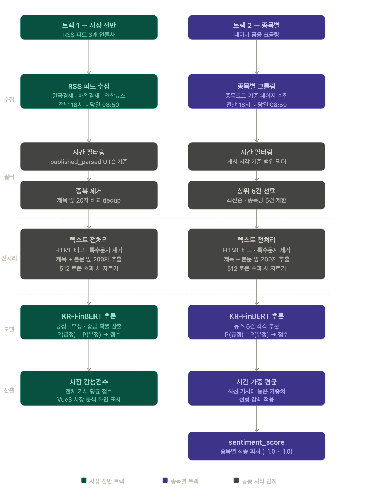

---

## 1. 개요

감성분석은 뉴스 텍스트를 KR-FinBERT 모델로 처리하여 **1개 피처(sentiment_score)**를 산출하는 단계다. 수집 목적에 따라 두 트랙으로 분리하여 운영하며, 각 트랙의 출력이 서로 다른 목적에 활용된다.

| 트랙 | 수집 대상 | 출력 | 활용처 |
| --- | --- | --- | --- |
| 트랙 1 — 시장 전반 | 경제·금융 전반 뉴스 | 시장 감성점수 | Vue3 AI 분석 화면 |
| 트랙 2 — 종목별 | 분석 대상 30개 종목 뉴스 | sentiment_score | Gemini 입력 피처 |

---

## 2. 수집 방식

### 2-1. 트랙 1 — RSS 피드 (시장 전반)

RSS 피드를 통해 경제·금융 전반의 뉴스를 수집한다. `feedparser` 라이브러리로 파싱하며, 별도의 크롤링 없이 XML 응답만으로 제목·본문 일부·게시 시각을 가져올 수 있어 안정적이다.

| 언론사 | RSS 주소 | 특징 |
| --- | --- | --- |
| 한국경제 | `https://www.hankyung.com/feed/finance` | 증시·경제 특화 |
| 매일경제 | `https://www.mk.co.kr/rss/30000001/` | 산업·기업 뉴스 강함 |
| 연합뉴스 | `https://www.yonhapnewstv.co.kr/browse/economy/rss` | 속보성 강함 |

**수집 시간 범위**: 전날 18:00 이후 ~ 당일 파이프라인 실행 직전(08:50)

RSS 피드의 `published_parsed` 타임스탬프는 언론사마다 표기 방식이 다르므로, UTC 기준으로 통일한 뒤 시간 범위를 비교한다.

### 2-2. 트랙 2 — 네이버 금융 크롤링 (종목별)

종목별 뉴스는 RSS로 제공되지 않으므로 BeautifulSoup으로 직접 크롤링한다. 네이버 금융은 종목코드 기반 URL 패턴을 제공하며, 이를 통해 특정 종목에 관련된 최신 뉴스를 수집할 수 있다.

```
URL 패턴: http://finance.naver.com/item/news_news.nhn?code={종목코드}&page=1
```

**수집 시간 범위**: 전날 18:00 이후 ~ 당일 파이프라인 실행 직전(08:50)

**수집 건수**: 종목당 최신순 상위 5건

종목당 5건은 핵심 감성 신호를 커버하기에 충분한 수이며, 건수가 늘어날수록 KR-FinBERT 처리 시간이 선형적으로 증가하므로 30종목 기준 균형점으로 설정한다.

---

## 3. 필터링

### 3-1. 시간 필터링

두 트랙 모두 수집 시간 범위 외의 기사를 제거한다. 트랙 1(RSS)은 `published_parsed`를 UTC로 변환하여 비교하고, 트랙 2(크롤링)는 네이버 금융에서 제공하는 게시 시각을 파싱하여 비교한다.

### 3-2. 중복 제거

같은 사건을 여러 언론사가 동시에 보도하는 경우 동일 내용이 중복 집계되어 감성 점수가 왜곡될 수 있다. 특히 연합뉴스 발 기사를 타 언론사가 그대로 받아쓰는 패턴이 빈번하다.

**제거 기준**: 기사 제목의 앞 20자를 비교하여 동일한 경우 중복으로 판단, 가장 오래된 원본만 남기고 나머지 제거

---

## 4. 전처리

두 트랙 모두 동일한 전처리 파이프라인을 적용한다.

### 4-1. 텍스트 정제

HTML 태그, 특수문자, 광고성 문구를 제거한다. 네이버 금융 크롤링 결과에는 불필요한 마크업이 포함되는 경우가 많아 정제가 필수적이다.

### 4-2. 입력 텍스트 구성

KR-FinBERT의 입력 텍스트는 **제목 + 본문 앞 200자**로 구성한다.

금융 뉴스는 제목과 본문 첫 단락에 핵심 정보가 집중되는 경향이 있다. 본문 전체를 사용하면 512 토큰 제한으로 인해 뒷부분이 잘리게 되며, 잘린 부분에 중요한 내용이 포함될 수 있다. 반대로 제목만 사용하면 "삼성전자 실적 발표"와 같이 감성이 중립적인 제목에서 본문의 핵심 내용(예: 예상치 20% 상회)을 놓칠 수 있다. 따라서 제목 + 본문 앞 200자가 512 토큰 제약 안에서 정보 밀도를 최대화하는 실용적 선택이다.

### 4-3. 토큰 길이 처리

구성된 텍스트가 512 토큰을 초과하는 경우 512 토큰에서 자른다. BERT 계열 모델의 구조적 제약이며, 초과분은 모델이 처리할 수 없다.

---

## 5. KR-FinBERT 추론

### 5-1. 모델 개요

KR-FinBERT는 한국어 금융 텍스트에 특화된 BERT 기반 감성분석 모델이다. 일반 BERT 모델과 달리 금융 도메인 용어와 맥락을 이해하도록 학습되어 있어 주식·경제 뉴스 감성 분류에 적합하다.

### 5-2. 출력 및 점수 변환

모델은 **긍정·부정·중립** 세 가지 레이블에 대한 확률값(소프트맥스)을 반환한다.

**점수 변환식**: P(긍정) - P(부정)

이 방식으로 -1.0 ~ 1.0 범위의 연속 점수를 산출한다. +1.0에 가까울수록 강한 긍정, -1.0에 가까울수록 강한 부정, 0에 가까울수록 중립을 의미한다.

---

## 6. 점수 산출 방식

### 6-1. 트랙 1 — 시장 감성점수

수집된 전체 기사의 점수를 단순 평균하여 당일 시장 전체의 감성 분위기를 하나의 수치로 표현한다. 이 값은 Gemini 입력 피처로 쓰이지 않고, Vue3 AI 분석 페이지의 **"오늘의 시장 분석"** 섹션에 시각화 자료로 표시된다.

### 6-2. 트랙 2 — 종목별 sentiment_score

종목별로 수집된 뉴스 5건 각각의 점수를 **시간 가중 평균**으로 통합한다.

최신 기사가 현재 시장 심리를 더 잘 반영하므로, 게시 시각 기준으로 최신 기사에 높은 가중치를 부여하는 선형 감쇠 방식을 적용한다. 예를 들어 5건이라면 최신 순서대로 가중치 5, 4, 3, 2, 1을 적용한 가중 평균을 산출한다.

**산출 결과**: 종목별 `sentiment_score` (-1.0 ~ 1.0), Gemini 입력 피처로 활용

---

## 7. 피처 정의

| 피처명 | 산출 방법 | 의미 | 값 범위 |
| --- | --- | --- | --- |
| `sentiment_score` | 종목별 뉴스 5건 시간 가중 평균 | 뉴스 감성 방향과 강도 | -1.0 ~ 1.0 |

**해석 기준**

| 범위 | 해석 |
| --- | --- |
| 0.5 이상 | 강한 긍정 — 호재성 뉴스 집중 |
| 0.1 ~ 0.5 | 약한 긍정 |
| -0.1 ~ 0.1 | 중립 |
| -0.5 ~ -0.1 | 약한 부정 |
| -0.5 이하 | 강한 부정 — 악재성 뉴스 집중 |

---

## 8. DB 저장 구조

감성분석 결과는 `news_analysis` 테이블에 저장된다.

| 컬럼명 | 타입 | 설명 |
| --- | --- | --- |
| stock_code | VARCHAR(10) | 종목 코드 (트랙 2) / NULL (트랙 1 시장 전반) |
| analysis_date | DATE | 분석 기준일 |
| sentiment_score | DECIMAL(5, 4) | 최종 감성 점수 (-1.0 ~ 1.0) |
| news_count | INT | 분석에 사용된 기사 수 |

---

## 9. Gemini 입력 컨텍스트 내 위치

`sentiment_score`는 정량 7개 + 시계열 2개와 함께 총 10개 피처 중 하나로 Gemini에 전달된다.

| 피처 그룹 | 피처 목록 |
| --- | --- |
| 정량 (KIS 기반) | morning_return, close_position, foreign_net_buy, institutional_net_buy |
| 정량 (DART 기반) | per, roe, operating_margin |
| **감성** | **sentiment_score** |
| 시계열 | prophet_price_trend, prophet_volume_trend |

감성 점수는 뉴스 기반의 단기 심리 변화를 반영하며, 정량 피처의 수급·가격 신호와 결합하여 Gemini 판단의 완성도를 높이는 역할을 한다. 특히 수급은 긍정적이지만 감성이 부정적인 경우(선반영 가능성), 또는 감성과 수급이 동시에 긍정적인 경우(신호 강화) 등을 Gemini가 종합적으로 판단하는 데 기여한다.

---

## 10. 주요 설계 결정 요약

| 항목 | 결정 내용 | 근거 |
| --- | --- | --- |
| 수집 시간 범위 | 전날 18:00 ~ 당일 08:50 | 장 마감 후 ~ 파이프라인 실행 전 전체 커버 |
| 시장 전반 수집 방식 | RSS 피드 (feedparser) | 안정적 구조화 데이터, 크롤링 불필요 |
| 종목별 수집 방식 | 네이버 금융 크롤링 | 종목 코드 기반 URL 패턴으로 정확한 관련 기사 수집 가능 |
| 입력 텍스트 구성 | 제목 + 본문 앞 200자 | 512 토큰 제약 내 최대 정보 밀도 |
| 종목당 기사 수 | 5건 | 감성 신호 안정성과 처리 시간의 균형점 |
| 중복 제거 기준 | 제목 앞 20자 비교 | 받아쓰기 기사 패턴 대응 |
| 점수 통합 방식 | 시간 가중 평균 (선형 감쇠) | 최신 기사가 현재 심리를 더 잘 반영 |
| 트랙 1 활용처 | Vue3 시장 분석 화면 | Gemini 입력과 역할 분리 |
| 트랙 2 활용처 | sentiment_score 피처 | Gemini 판단 컨텍스트 강화 |


