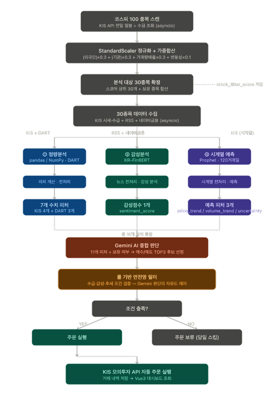
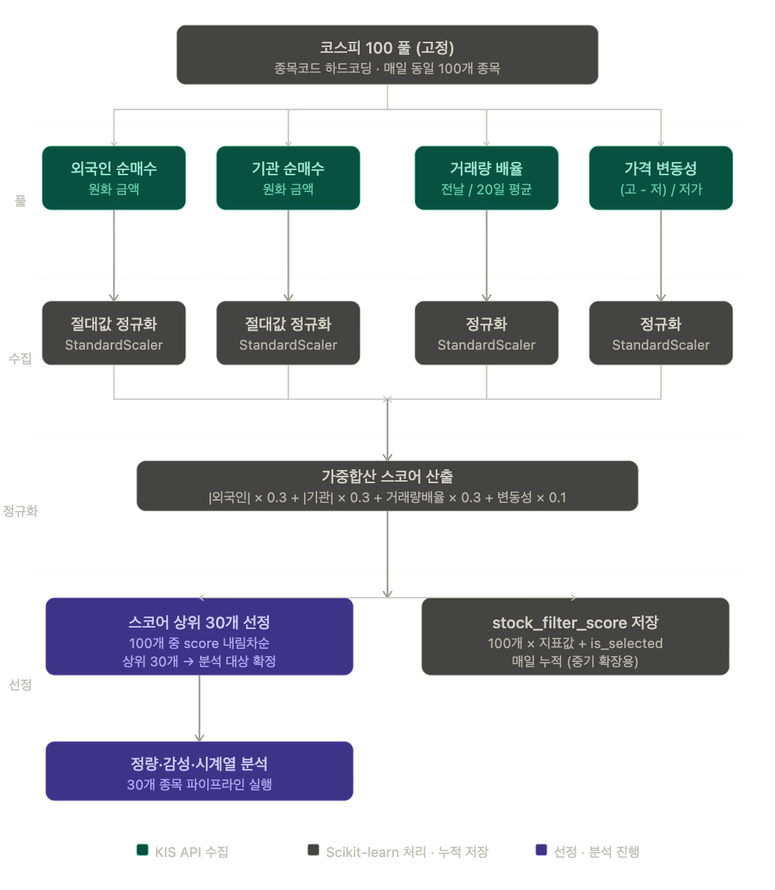
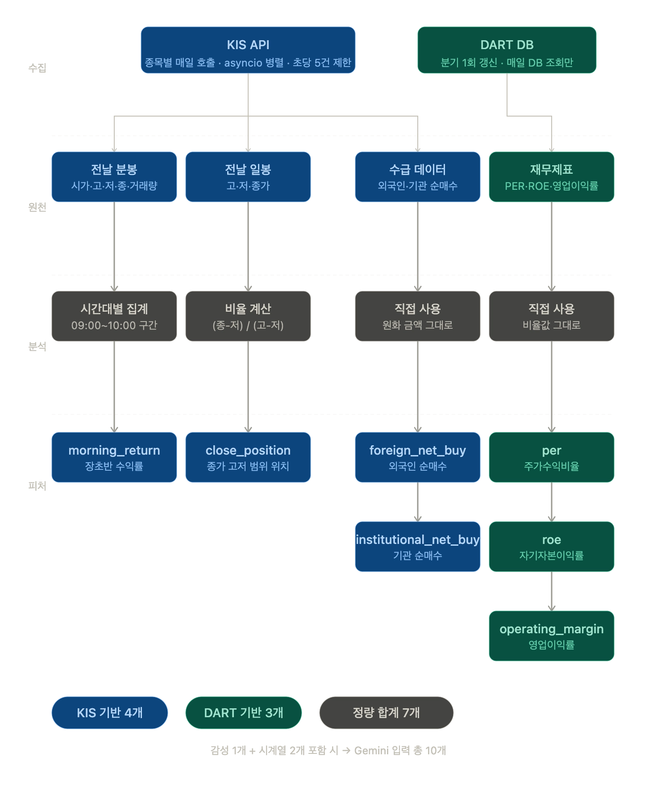
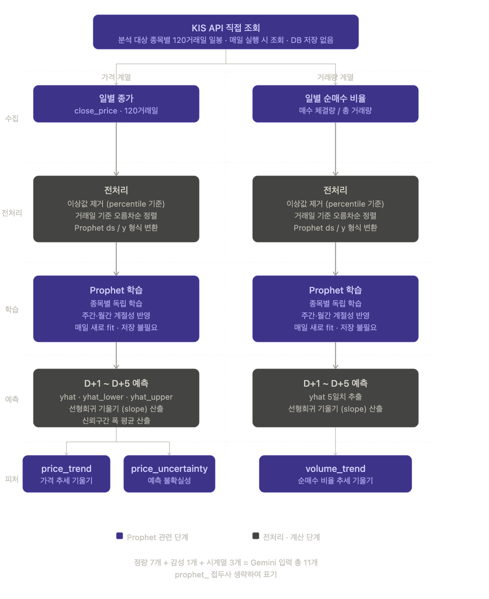

# PIPELINE_DESIGN — 일일 파이프라인 기능 설계서

> 이 문서는 일일 파이프라인의 **기능 설계서**다. Stage 0~6 각 단계의 알고리즘, 입출력, 설계 결정 근거를 코드 기준으로 정리한다.
> 디렉터리/컴포넌트 구조는 [ARCHITECTURE.md](ARCHITECTURE.md), DB 스키마는 [API_REFERENCE.md](API_REFERENCE.md), 진행 상황은 [STATUS.md](STATUS.md) 참고.
> 본 문서는 기존 `_analysis_flow/` 설계서 4종(Top30 필터 / 정량 / 감성 / 시계열)을 통합한 것이다.

전체 분석 흐름 개요도:



---

## 11개 Gemini 입력 피처 한눈에 보기

| # | 피처 | 출처 Stage | 출처 테이블 | 의미 |
| --- | --- | --- | --- | --- |
| 1 | `morning_return` | 2-1-B | `stock_filter_score` | 장초반(09:00~10:00) 수익률(%) |
| 2 | `close_position` | 2-1-B | `stock_filter_score` | 종가의 고저 범위 내 위치(0~1) |
| 3 | `foreign_net_buy` | 1 / 2-1 | `stock_filter_score` | 외국인 순매수(원) |
| 4 | `institutional_net_buy` | 1 / 2-1 | `stock_filter_score` | 기관 순매수(원) |
| 5 | `per` | 2-1-A | `stock_financial` | 주가수익비율 (KIS 시세로 보강) |
| 6 | `roe` | 2-1-A | `stock_financial` | 자기자본이익률(%) |
| 7 | `operating_margin` | 2-1-A | `stock_financial` | 영업이익률(%) |
| 8 | `sentiment_score` | 2-2 | `news_analysis` | 뉴스 감성(-1.0~1.0) |
| 9 | `prophet_price_trend` | 2-3 | `prophet_forecast` | D+1~D+5 가격 추세 기울기 |
| 10 | `prophet_volume_trend` | 2-3 | `prophet_forecast` | D+1~D+5 순매수 비율 추세 기울기 |
| 11 | `prophet_price_uncertainty` | 2-3 | `prophet_forecast` | 예측 불확실성(신뢰구간 폭 평균) |

---

## Stage 0 — 휴장일 체크

**목적**: 파이프라인 본 작업 전 시장 개장 여부를 확인해 휴장일 불필요 호출을 방지한다.

**구현**: `KISClient.is_market_open(trade_date)` (`collectors/kis_client.py`)

2단계 검사:
1. **주말 체크**: KST 기준 요일이 토(5)/일(6)이면 휴장.
2. **실시간 API 테스트**: 삼성전자(005930) 수급 API를 호출해 정상 응답이면 개장, HTTP 500 등 실패면 휴장(공휴일)으로 판정.

휴장 판정 시 `run_stage1_filtering`은 즉시 다음을 반환하고 파이프라인을 중단한다:

```json
{ "success": false, "trade_date": "...", "error": "오늘은 휴장일입니다", "is_holiday": true }
```

---

## Stage 1 — 종목 필터링 (KOSPI 100 → Top 30)



**목적**: KOSPI 100 풀에서 매일 분석 대상 30개를 ML 스코어링으로 선정한다.

**구현**: `StockFilter` (`analysis/filter.py`) + `KISClient.fetch_stock_data_parallel`

### 1-1. KOSPI 100 풀 관리

- 후보군은 KOSPI 시가총액 상위 100개를 `config/constants.py`의 `KOSPI_100`에 하드코딩으로 고정.
- 고정 이유: ① 매일 동일 집합 수집으로 데이터 일관성 확보, ② StandardScaler가 매일 동일한 100개 기준으로 정규화하므로 일자 간 스코어 비교가 의미 있어짐.

### 1-2. 수집 지표 (종목당 KIS 호출)

| 지표 | 산출 | API |
| --- | --- | --- |
| 외국인 순매수 | 원화 순매수 금액 | FHKST01010900 (1회로 외국인·기관 동시) |
| 기관 순매수 | 원화 순매수 금액 | (동일 호출) |
| 거래량 배율 | 전날 거래량 / 20일 평균 거래량 | 일봉 조회 |
| 가격 변동성 | (고가 − 저가) / 저가 | 일봉 조회 |

호출량: 종목당 2회 × 100 = 약 200회, 초당 5건 제한으로 약 40초.

### 1-3. StandardScaler 정규화 + 가중합

4개 지표는 단위·스케일이 달라 직접 합산 불가 → StandardScaler로 평균 0, 표준편차 1 변환.

- **수급 지표는 절대값으로 변환 후 정규화**: 순매수(양수)·순매도(음수) 모두 "강한 움직임"으로 해석.
- **매일 새로 fit**: 당일 100개 종목 기준 상대 비교(어제 기준 아님).

**스코어 산출식**:

```
score = |외국인 순매수| × 0.3
      + |기관 순매수|   × 0.3
      + 거래량 배율     × 0.3
      + 가격 변동성     × 0.1
```

| 지표 | 가중치 | 근거 |
| --- | --- | --- |
| 외국인 순매수 | 0.3 | 정보력 높은 주체의 자금 방향 |
| 기관 순매수 | 0.3 | 정보력 높은 주체의 자금 방향 |
| 거래량 배율 | 0.3 | 수급 없이 거래량만 터진 종목도 포착 |
| 가격 변동성 | 0.1 | 보조 신호 |

### 1-4. Top 30 선정 + 보유 종목 강제 포함

- score 내림차순 상위 30개 선정.
- `KISClient.get_holdings()`로 조회한 보유 종목 + 트리거 파라미터 holdings는 **무조건 포함**(매도 분석 보장).

### 1-5. 저장

- `stock_filter_score`: 종목별 지표 + `scaler_score` + `is_selected`.
- `market_daily_summary`: KOSPI 지수/등락률/거래량 + 전체 외국인·기관 순매수 합계. (종목별 등락률을 Stage 1 수집기가 반환하지 않아 `rising/falling/unchanged_stocks`는 `None`으로 둠 — 임의 값 생성 금지.)

> **DataFrame ↔ DB 컬럼**: 내부 DataFrame은 `final_score`/`volume_ratio`/`institution_net_buy`를 쓰고, `DatabaseRepository.save_filter_scores`가 DB 컬럼 `scaler_score`/`vol_avg_multiple`/`institutional_net_buy`로 매핑한다.

### StockFilter 출력 DataFrame 컬럼

`stock_code, stock_name, foreign_net_buy, institutional_net_buy, volume_ratio, price_volatility, final_score, is_selected`

---

## Stage 2-1 — 정량 분석 (7개 피처)



**목적**: KIS·DART 원천 데이터를 가공해 7개 정량 피처를 산출한다.

**구현**: `QuantitativeAnalyzer` (`analysis/quantitative.py`), `DARTAPIClient` (`collectors/dart_client.py`)

### 2-1-A. DART 기반 피처 (3개)

분기 1회 수집하여 `stock_financial`에 저장하고 매일 조회만 한다.

| 피처 | 의미 | 해석 |
| --- | --- | --- |
| `per` | 주가수익비율 | 낮을수록 저평가 |
| `roe` | 자기자본이익률(%) | 높을수록 우량 |
| `operating_margin` | 영업이익률(%) | 높을수록 안정 |

- 보고서 코드: Q1=11013, Q2=11012(반기), Q3=11014, Q4=11011(사업보고서).
- 최신 분기 미공시 대비 **최대 5분기 fallback 탐색**(`collect_financials_with_fallback`). CFS(연결)→OFS(개별) fallback.
- **PER은 DART만으로 산출 불가** → Stage 2-1-A에서 KIS 시세(`get_valuations_for_stocks`)로 보강. 적자/결측 종목은 `None` 유지(null-safe).

### 2-1-B. KIS 기반 피처 (4개)

Stage 1에서 수집한 데이터를 재사용(`stage1_data`)하여 중복 호출을 줄인다.

| 피처 | 산출 | 해석 |
| --- | --- | --- |
| `morning_return` | (10:00 종가 − 시가) / 시가 × 100 (분봉) | 양수 → 매수세 |
| `close_position` | (종가 − 저가) / (고가 − 저가) (일봉) | 1에 가까울수록 강세 마감 |
| `foreign_net_buy` | 수급 데이터 원화 금액 그대로 | 양수 → 순매수 |
| `institutional_net_buy` | 수급 데이터 원화 금액 그대로 | 양수 → 순매수 |

- 이상값 처리: KIS 피처는 NumPy percentile 99 클리핑. DART 피처는 적자 기업 표현을 위해 NaN/None 유지.
- `morning_return`/`close_position`는 `stock_filter_score` 행을 **UPDATE**로 채운다(Stage 1에서 생성된 행).

### QuantitativeAnalyzer 출력 DataFrame 컬럼

`stock_code, morning_return, close_position, foreign_net_buy, institutional_net_buy, per, roe, operating_margin`

---

## Stage 2-2 — 감성 분석 (1개 피처)


**목적**: 뉴스 텍스트를 KR-FinBERT로 처리해 `sentiment_score`(−1.0~1.0)를 산출한다.

**구현**: `SentimentAnalyzer` (`analysis/sentiment.py`), `KRFinBERTAnalyzer` (`models/kr_finbert.py`), `NewsCollector` (`collectors/news_collector.py`)

### 2-2-1. 두 트랙 구조

| 트랙 | 수집 대상 | 출력 | 활용처 |
| --- | --- | --- | --- |
| 1 — 시장 전반 | 경제·금융 RSS | 시장 감성점수 | Vue3 AI 분석 화면 (`market_daily_summary`) |
| 2 — 종목별 | 분석 대상 종목 뉴스 | `sentiment_score` | Gemini 입력 피처 (`news_analysis`) |

### 2-2-2. 수집

- **Track 1 (RSS)**: 한국경제(`hankyung.com/feed/finance`), 매일경제(`mk.co.kr/rss/30000001/`), 연합뉴스(`yonhapnewstv.co.kr/browse/economy/rss`). `feedparser`로 파싱.
- **Track 2 (네이버 금융)**: 네이버 금융 뉴스 JSON API(`api.stock.naver.com`)에서 종목당 최신 5건. (구 HTML 스크레이핑을 JSON API로 대체.)
- 수집 시간 범위: 전날 18:00 ~ 당일 실행 직전.

### 2-2-3. 필터링·전처리

- 시간 필터링, 제목 앞 20자 기준 중복 제거.
- 입력 텍스트 = 제목 + 본문 앞 200자, 512 토큰 초과분 truncation.

### 2-2-4. KR-FinBERT 추론

- 모델: `snunlp/KR-FinBert-SC` (긍정/부정/중립 3-class).
- 점수 변환: `score = P(긍정) − P(부정)`, 범위 −1.0~1.0.
- **Track 1 (시장)**: 전체 기사 단순 평균. `SentimentAnalyzer.last_market_sentiment`/`last_market_news_count`에 보관 후 영속화.
- **Track 2 (종목별)**: 5건을 **시간 가중 평균**(최신순 가중치 5,4,3,2,1). 종목 뉴스 수집 실패 시 시장 감성으로 fallback(이때 `news_count=0`).

### 2-2-5. 저장

- `news_analysis`: 종목별 행(Track 2) + 시장 전반 행(Track 1, `stock_code=NULL`).
- NULL 행은 PostgreSQL에서 UNIQUE 제약이 중복을 막지 못하므로, repository가 `IS NULL` 매칭으로 기존 행 삭제 후 1건만 삽입한다. 종목별 행은 `ON CONFLICT (stock_code, analysis_date) DO UPDATE`.
- `market_daily_summary.market_sentiment_score`는 Stage 1에서 생성된 행을 `update_market_sentiment`로 갱신.

### SentimentAnalyzer 출력 DataFrame 컬럼

`stock_code, sentiment_score, news_count`

**해석 기준**: 0.5↑ 강한 긍정 / 0.1~0.5 약한 긍정 / −0.1~0.1 중립 / −0.5~−0.1 약한 부정 / −0.5↓ 강한 부정.

---

## Stage 2-3 — 시계열 분석 (3개 피처)



**목적**: Prophet으로 120거래일을 학습해 D+1~D+5 추세 3개 피처를 산출한다.

**구현**: `TimeSeriesAnalyzer` (`analysis/timeseries.py`), `ProphetForecaster` (`models/prophet_trainer.py`)

### 2-3-1. 설계 원칙

- **DB 저장 없이 KIS 직접 조회**: 매일 종목이 바뀌어 누적 학습 실익이 낮음. 학습 후 원천 데이터는 버림(다만 예측 결과는 `prophet_forecast`에 저장).
- **종목별 독립 학습, 매일 새로 fit**: Prophet은 단변량 모델이라 종목 합산 불가. 모델 객체는 저장하지 않음.
- **5거래일 예측 → 기울기 피처**: 단일 하루보다 추세 방향이 유의미.
- **순매수 비율 사용**: 총 거래량 대비 방향성(매수 주도 vs 매도 주도) 확보.

### 2-3-2. 데이터 수집

- 가격 계열: `get_daily_ohlcv_period(120)`(FHKST03010100). 60일 미만이면 `get_daily_ohlcv(100)`로 fallback (`MIN_TRADING_DAYS = 60`).
- 거래량(순매수 비율) 계열: `get_daily_trade_volume`(체결 거래량). 실패 시 OHLCV close-position proxy로 fallback.

### 2-3-3. 전처리 (ProphetForecaster)

- NumPy percentile [p1, p99] winsorization으로 이상값 제거.
- 거래일 오름차순 정렬, 중복 제거.
- Prophet 입력 형식 `ds`(날짜)/`y`(값) 변환.
- 학습 가능 조건: ≥10 포인트, 서로 다른 값 ≥2개, NaN/inf 없음. 최대 2회 재시도.

### 2-3-4. 모델 구성

```
Prophet(daily_seasonality=False, weekly_seasonality=True, yearly_seasonality=False)
stan_backend = CMDSTANPY
```

120거래일(약 6개월)로 주간·월간 계절성은 학습 가능, 연간은 불가(250거래일 필요).

### 2-3-5. 피처 산출

| 피처 | 산출 | 해석 |
| --- | --- | --- |
| `prophet_price_trend` | D+1~D+5 `yhat` 5개 값의 선형회귀 기울기 | 양수 → 상승 기조 |
| `prophet_volume_trend` | 순매수 비율 D+1~D+5 `yhat` 기울기 | 양수 → 매수세 강화 |
| `prophet_price_uncertainty` | mean(`yhat_upper` − `yhat_lower`) for D+1~D+5 | 클수록 불확실성 높음 |

### 2-3-6. 저장

- `prophet_forecast`: 추세 3개(`price_trend`/`volume_trend`/`price_uncertainty`) + 상세 `yhat_d1~d5`/`yhat_upper_d1~d5`/`yhat_lower_d1~d5`.
- repository가 `(stock_code, forecast_date)` UPSERT(삭제 후 삽입) 처리. DB NUMERIC 정밀도 초과 방지 위해 clamping 적용.

### TimeSeriesAnalyzer 출력

각 종목 dict에 `prophet_price_trend`, `prophet_volume_trend`, `prophet_price_uncertainty` 및 상세 `yhat_price_d1~d5`/`yhat_volume_d1~d5`(신뢰구간 포함) 포함.

---

## Stage 4 — Gemini AI 결정

**목적**: 11개 피처를 종합해 매수/매도 TOP3를 결정한다.

**구현**: `TradingDecisionGenerator` (`ai/decision_generator.py`), `GeminiClient` (`ai/gemini_client.py`)

### 4-1. 피처 병합 및 프롬프트 구성

- `generate_decisions(quant_features, sentiment_features, timeseries_features)`가 3개 DataFrame을 `stock_code` 기준 left join.
- 종목별 11개 피처를 포맷팅한 컨텍스트 문자열 생성. PER 결측은 `"적자 또는 결측"`, 퍼센트 결측은 `"결측"`으로 표기.
- 6개 판단 기준 제시: ① 수급, ② 모멘텀, ③ 펀더멘탈, ④ 감성, ⑤ 추세, ⑥ 불확실성.

### 4-2. Gemini 호출 및 출력

- 모델: `models/gemini-2.5-flash`.
- 출력 JSON:

```json
{
  "buy_top3":  [{"stock_code": "005930", "reason": "..."}, ...3개],
  "sell_top3": [{"stock_code": "005380", "reason": "..."}, ...3개]
}
```

- 마크다운 코드블록(` ```json `) 제거 후 파싱. `validate_decision`으로 구조·개수(3)·코드 중복·매수/매도 겹침 검증.
- `GEMINI_API_KEY` 미설정 시 `_get_mock_decision()`이 mock 결과 반환.

### 4-3. 저장

`ai_trade_decision`에 매수 3 + 매도 3 = 6행. repository가 `STOCK_NAMES`로 종목명 보강, `decision` 컬럼에 `'BUY'`/`'SELL'`, 기준일은 `decision_date`.

---

## Stage 5 — Safety Filter

**목적**: Gemini 결정을 피처 규칙으로 사후 검증하고, 투자한도 기반 매수 수량을 산출한다.

**구현**: `SafetyFilter` (`filters/safety_filter.py`)

### 5-1. 기본 임계값 (생성자 기본값)

| 파라미터 | 기본값 | 용도 |
| --- | --- | --- |
| `sentiment_positive_threshold` | 0.3 | 매수 감성 하한 |
| `sentiment_negative_threshold` | −0.3 | 매도 감성 상한 |
| `uncertainty_threshold` | 500 | 예측 불확실성 상한 |
| `per_max_threshold` | 30.0 | 매수 PER 상한 |
| `roe_min_threshold` | 10.0 | 매수 ROE 하한(%) |
| `operating_margin_min` | 5.0 | 매수 영업이익률 하한(%) |
| `close_position_min` | 0.6 | 매수 종가 위치 하한 |
| `volume_trend_min` | 0.0 | 매수 거래량 추세 하한 |

> 이 임계값들은 DB `feature_threshold_config` 테이블의 기본 INSERT 값과 일치한다(추후 UI 동적 조정 확장 여지).

### 5-2. 매수 필터 (모든 규칙 통과해야 함)

1. `price_uncertainty` ≤ 500
2. `foreign_net_buy` > 0
3. `institutional_net_buy` > 0
4. `sentiment_score` ≥ 0.3
5. `prophet_price_trend` > 0
6. `prophet_volume_trend` > 0
7. `per` ≤ 30 (None → 탈락)
8. `roe` ≥ 10 (None/NaN → 탈락)
9. `operating_margin` ≥ 5 (None/NaN → 탈락)
10. `morning_return` > 0
11. `close_position` ≥ 0.6

### 5-3. 매도 필터

1. `price_uncertainty` ≤ 500 (hard stop)
2. `foreign_net_buy` < 0 **또는** `institutional_net_buy` < 0
3. `sentiment_score` ≤ −0.3 **또는** `prophet_price_trend` < 0

### 5-4. 투자한도 검증

`check_investment_limit(stock_code, current_price, order_amount)`이 `user_trade_config.order_amount`(기본 1,000,000원) 기준 `max_quantity`를 계산한다. 매수 후보의 현재가는 Stage 5에서 `get_current_price`로 조회.

### 5-5. 저장

`safety_filter_result`에 종목별 `passed`, `failure_reason`, `max_quantity`, `current_price`, `filter_checks`(JSONB) 저장. JSON 직렬화 시 numpy 타입·NaN/Inf를 안전하게 정제하고, bulk insert 실패 시 행 단위 fallback.

---

## Stage 6 — 거래 실행

**목적**: Safety Filter 통과 결정을 api-server를 통해 KIS 주문으로 실행한다.

**구현**: `TradeExecutor` (`execution/trade_executor.py`)

- `check_auto_trading_enabled(user_id=1)`로 `user_trade_config.is_active` 확인. `false`면 `status: 'skipped'`로 종료.
- `get_holdings()`로 보유 수량 조회 → 매수는 요청 수량, 매도는 보유 수량이 있을 때만 실행.
- api-server `POST /api/trading/execute` 호출. 주문 체결 이력(`trade_history`)은 api-server가 기록한다.

출력:

```python
{
  "buy_results": [...],
  "sell_results": [...],
  "status": "executed" | "skipped",
  "executed_at": "..."  # 또는 skip 시 "reason"
}
```

---

## Stage 3 (차트 생성) — 현재 미구현

CLAUDE.md/구 문서에는 Stage 3에서 matplotlib PNG 4종을 `/static/charts/`에 생성한다고 기술되어 있으나, **현재 코드에는 차트 생성 모듈(`charts/`)·matplotlib 호출·`static/charts/` 출력이 존재하지 않는다.** `run_complete_pipeline`도 Stage 3을 건너뛴다(코드 주석: "Chart Generation (skipped for now, add later)"). 상세는 [STATUS.md](STATUS.md) 참고.
